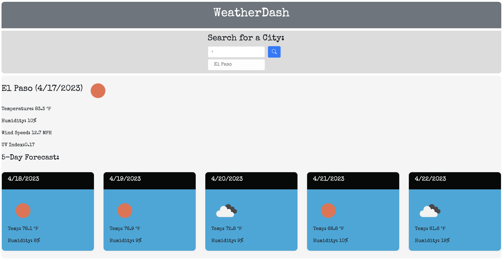

# WeatherDash Weather dashboard
WeatherDash is a web-based weather dashboard app that provides users with a five-day forecast for any location. The app is designed to be user-friendly and intuitive, with a sleek and modern interface that makes it easy to access all the weather data you need at a glance. With WeatherDash, users can quickly and easily get up-to-date information on current temperature, humidity, wind speed and uv-index as well as cards for each day showing forecast, temperature and humidity. Whether you're planning a trip, going for a run, or just want to stay informed about the weather, WeatherDash is the perfect tool for staying ahead of the curve.

## Table of content
-Page image and link
-Built with
-Attributes and Acknowledgements
-license

https://oronafrankie87.github.io./WeatherDash/

## Built with
 This Weather Dashboard was built with HTML, CSS, JavaScript, 
  Bootstrap, Google fonts, dayjs and weather API link below...
  "https://api.openweathermap.org/data/2.5/weather?q="

## Attributes and Acknowledgements
  Code and styling completed by the developer with some input by my tutor, Jacob Nordon.  Reference was taken heavily from Weather Dashboard project done by github.com/Owaislslam.  The code was put through ChatGPT piece by piece to understand how it works and deconstruct it.
 

 ## License
  This app has an MIT license